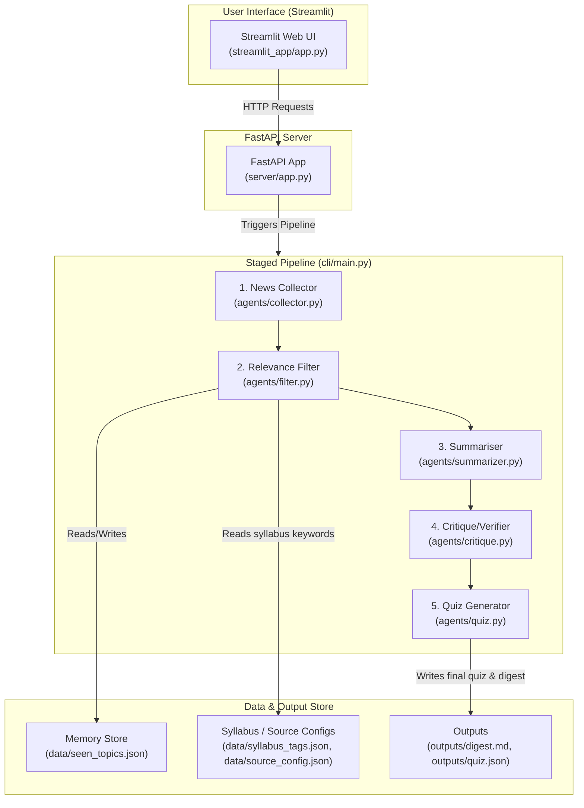

# ExamDigest Architecture 🏗️

This document details the system design, pipeline stages, data file layout and  API reference of ExamDigest.

---

## 🏗️ System Design

### Pipeline Stages

| # | Stage | File | Description |
|---|-------|------|-------------|
| 1 | **News Collector** | [collector.py](agents/collector.py) | Returns mock article data by default, or free live-source results in live mode |
| 2 | **Relevance Filter** | [filter.py](agents/filter.py) | Matches articles to exam syllabus tags; skips seen topics |
| 3 | **Summariser** | [summarizer.py](agents/summarizer.py) | Rewrites each selected item into a concise, syllabus-relevant fact |
| 4 | **Critique / Verifier** | [critique.py](agents/critique.py) | Fast URL/content checks plus optional Gemini faithfulness verification when an API key is available |
| 5 | **Quiz Generator** | [quiz.py](agents/quiz.py) | Produces 5 MCQs mapped to digest facts, with Gemini-backed generation and template fallback when needed |

### Data Files

| File | Purpose |
|------|---------|
| [syllabus_tags.json](data/syllabus_tags.json) | Keyword/tag maps for PSC, SSC, and Railway syllabi |
| [source_config.json](data/source_config.json) | Free live-source query configuration for each exam |
| [seen_topics.json](data/seen_topics.json) | Memory store — tracks titles & URLs already shown |
| `data/cache/` | Local cache for live-source fetches; ignored by git |
| `outputs/digest.md` | Last generated digest in Markdown format |
| `outputs/quiz.json` | Last generated quiz in JSON format |

---

## 🌐 API Reference

Full interactive docs at `http://localhost:8000/docs` (Swagger UI).

---

