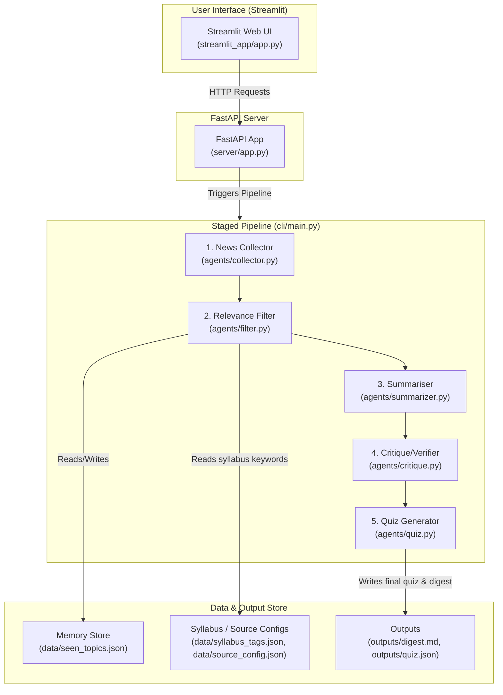

# ExamDigest Architecture 🏗️

This document details the system design, pipeline stages, data file layout, API reference, and project structure of ExamDigest.

For setup and run instructions, please refer to the [README.md](README.md). For product goals and requirements, see [SPEC.md](SPEC.md).

---

## 🏗️ System Design



### Pipeline Stages

| # | Stage | File | Description |
|---|-------|------|-------------|
| 1 | **News Collector** | [collector.py](agents/collector.py) | Returns mock article data by default, or free live-source results in live mode |
| 2 | **Relevance Filter** | [filter.py](agents/filter.py) | Matches articles to exam syllabus tags; skips seen topics |
| 3 | **Summariser** | [summarizer.py](agents/summarizer.py) | Rewrites each selected item into a concise, syllabus-relevant fact |
| 4 | **Critique / Verifier** | [critique.py](agents/critique.py) | Fast URL/content checks plus optional Gemini faithfulness verification when an API key is available |
| 5 | **Quiz Generator** | [quiz.py](agents/quiz.py) | Produces 5 MCQs mapped to digest facts, with Gemini-backed generation and template fallback when needed |

### Data Files

| File | Purpose |
|------|---------|
| [syllabus_tags.json](data/syllabus_tags.json) | Keyword/tag maps for PSC, SSC, and Railway syllabi |
| [source_config.json](data/source_config.json) | Free live-source query configuration for each exam |
| [seen_topics.json](data/seen_topics.json) | Memory store — tracks titles & URLs already shown |
| `data/cache/` | Local cache for live-source fetches; ignored by git |
| `outputs/digest.md` | Last generated digest in Markdown format |
| `outputs/quiz.json` | Last generated quiz in JSON format |

---

## 🌐 API Reference

| Method | Endpoint | Description |
|--------|----------|-------------|
| `GET` | `/` | API info and endpoint listing |
| `GET` | `/health` | Liveness probe |
| `GET` | `/current-affairs?exam={psc\|ssc\|railway}` | Run pipeline; return digest facts |
| `GET` | `/quiz?exam={psc\|ssc\|railway}` | Run pipeline; return 5-question quiz |
| `GET` | `/generate?exam={psc\|ssc\|railway}&data_mode={mock\|live}` | Run with selected data mode |
| `POST` | `/reset-memory` | Clear `seen_topics.json` dedup memory |

Full interactive docs at `http://localhost:8000/docs` (Swagger UI).

---

## 📂 Project Structure

> **Note:** This layout reflects how the repository will appear once pushed to GitHub.

```
.
├── agents/
│   ├── collector.py      # Stage 1: Mock news article database
│   ├── filter.py         # Stage 2: Syllabus relevance + deduplication
│   ├── summarizer.py     # Stage 3: Exam-ready fact generation
│   ├── critique.py       # Stage 4: Quality verification
│   └── quiz.py           # Stage 5: MCQ generation
├── cli/
│   └── main.py           # Module CLI entrypoint (--exam, --reset-memory)
├── server/
│   └── app.py            # FastAPI REST API server
├── streamlit_app/
│   └── app.py            # Streamlit web UI
├── data/
│   ├── syllabus_tags.json # Exam-to-tags mapping
│   ├── source_config.json # Free live-source query config
│   └── seen_topics.json   # Deduplication memory store
├── outputs/
│   ├── digest.md          # Last generated digest (Markdown)
│   └── quiz.json          # Last generated quiz (JSON)
├── main.py               # Root CLI entrypoint
├── requirements.txt
├── SPEC.md
├── README.md
└── .github/workflows/tests.yml
```
