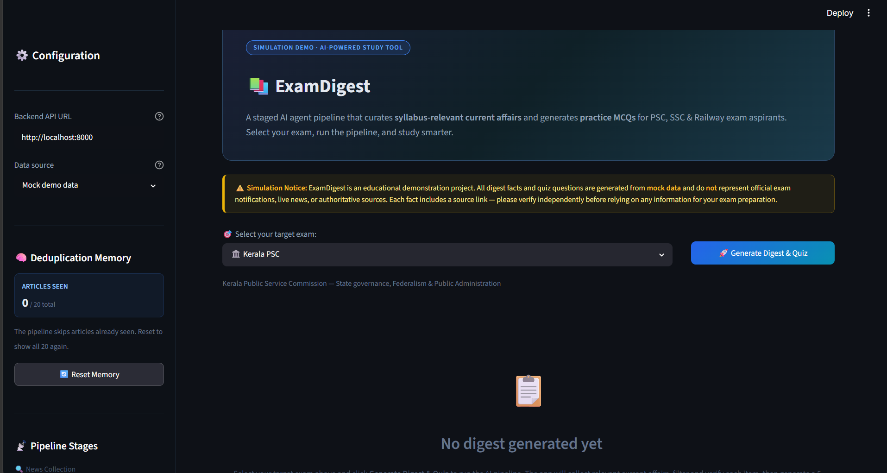

# ExamDigest 📚

> **⚠️ Simulation Notice:** ExamDigest is an **educational demonstration project**. It defaults to
> deterministic **mock data** for reliable demos, and can optionally fetch best-effort free public
> live sources. It does not represent official exam notifications. Each fact includes a source link
> — please verify independently before relying on any information for your exam preparation.

ExamDigest helps aspirants quickly prepare current affairs without scanning raw news. The project combines a simple Streamlit
UI with a staged AI-agent workflow that turns topic discovery into study-ready facts and short practice
quizzes.

---

## 🎯 Overview

- **Problem:** Aspirants need quick, relevant updates for PSC, SSC, and Railway prep without spending hours scanning news.
- **Solution:** A lightweight pipeline that collects candidate topics, filters them by exam relevance, summarizes them into concise facts, and generates a short quiz.
- **Experience:** The interface is intentionally simple and presentation-friendly, making the project feel demo-ready for hackathons, portfolios, and product pitches.

For more technical details on system design, data schema, and api reference, see the [ARCHITECTURE.md](ARCHITECTURE.md) and [SPEC.md](SPEC.md).

---

## 📸 Project Demo Screenshot

> Local preview is available at http://127.0.0.1:8501 while the app is running. 




---

## ✨ Features

| Feature | Details |
|---|---|
| **Staged Agent Pipeline** | 5 cleanly separated stages: Collect → Filter → Summarize → Verify → Quiz |
| **Mock + Live Data Modes** | Mock data by default, optional live feeds. |
| **Syllabus Tag Filtering** | Articles scored against PSC / SSC / Railway keyword maps |
| **Deduplication Memory** | `seen_topics.json` prevents repeat articles across runs |
| **Interactive Quiz** | 5 MCQs with real-time scoring, explanations & grade banner |
| **CLI & REST API Support** | Run via CLI or access endpoints with FastAPI backend |

---

## 🛠️ Setup Instructions

### Prerequisites
- Python 3.10+
- [`uv`](https://github.com/astral-sh/uv) package manager

### 1. Clone the repository

```bash
git clone <repo-url>
cd ExamDigest
```

### 2. Create and activate a virtual environment

```bash
uv venv
source .venv/bin/activate   # Windows: .venv\Scripts\activate
```

### 3. Install dependencies

```bash
uv pip install -r requirements.txt
```

### 4. Configure environment variables

Create a `.env` file if you want to override defaults locally:

```bash
touch .env
```

- `GEMINI_API_KEY` enables the Gemini-backed summarizer, quiz generator, and critique verifier. When it is not set, the app falls back to heuristic summaries, template-based quiz questions, and conservative verification. **If omitted, the system runs fully offline using mock client fallback.**
- `DATA_MODE` controls the default CLI/API behavior (`mock` or `live`).

---

## 🚀 Running Locally

Start both the FastAPI backend and the Streamlit UI with a single command:

### Linux/macOS

```bash
./run.sh
```

### Windows

```bat
run.bat
```

The launcher starts:
- the backend at `http://localhost:8000`
- the Streamlit UI at `http://localhost:8501`

Interactive Swagger docs: `http://localhost:8000/docs`

If you prefer to start them manually, you can still run the two services separately:

```bash
uv run python -m uvicorn server.app:app --host 127.0.0.1 --port 8000 --reload
uv run python -m streamlit run streamlit_app/app.py
```

---

## 💻 CLI Usage

```bash
# Run via the root entrypoint
python main.py --exam psc

# Run via the module entrypoint
python cli/main.py --exam psc

# Run with free live public sources instead of deterministic mock data
python main.py --exam psc --data-mode live

# Run pipeline for SSC
python main.py --exam ssc

# Run pipeline for Railway
python main.py --exam railway

# Clear deduplication memory (allows re-running the full dataset)
python main.py --reset-memory

# Reset memory AND run the pipeline
python main.py --exam psc --reset-memory
```

Output files are saved to `outputs/digest.md` and `outputs/quiz.json`.

---

## 🔮 What's Next

- **Richer Live News Sources** — Expand live mode beyond GDELT with curated RSS feeds and Google News / NewsAPI integrations
- **Daily Scheduler** — Cron job to auto-run the pipeline and push digests via email/WhatsApp
- **Multilingual Support** — Digest and quiz output in Malayalam, Hindi, Tamil
- **Production Deployment** — Streamlit Cloud + Cloud Run containerised backend with CI/CD
