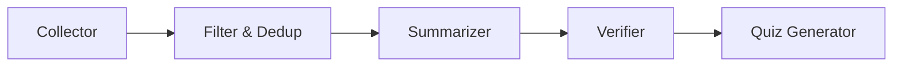

# ExamDigest 📚

> **⚠️ Simulation Notice:** ExamDigest is an **educational demonstration project**. It defaults to
> deterministic **mock data** for reliable demos, and can optionally fetch best-effort free public
> live sources. It does not represent official exam notifications. Each fact includes a source link
> — please verify independently before relying on any information for your exam preparation.

ExamDigest helps aspirants quickly prepare current affairs without scanning raw news. The project combines a simple Streamlit
UI with a staged AI-agent workflow that turns topic discovery into study-ready facts and short practice
quizzes.

## 🎯 Overview

- **Problem:** Aspirants need quick, relevant updates for PSC, SSC, and Railway prep without spending hours scanning news.
- **Solution:** A lightweight pipeline that collects candidate topics, filters them by exam relevance, summarizes them into concise facts, and generates a short quiz.
- **Experience:** The interface is intentionally simple and presentation-friendly, making the project feel demo-ready for hackathons, portfolios, and product pitches.

## 🧭 Planned Pipeline

The current build highlights a practical demo path centered on:

collector → summarizer → quiz generator → verifier

Supported by filtering, deduplication, and source-traceability for clarity.

## 📊 Demo Flow




---

## ✨ Features

| Feature | Details |
|---|---|
| **Staged Agent Pipeline** | 5 cleanly separated stages: Collect → Filter → Summarise → Verify → Quiz |
| **Mock + Live Data Modes** | Mock data by default, optional live feeds. |
| **Kerala-specific Content** | Vizhinjam Port, KFON, K-Smart, Aksharasree, Kudumbashree & more |
| **Indian National Affairs** | ISRO Gaganyaan, India Semiconductor Mission, UPS, Kavach, Vande Bharat |
| **Syllabus Tag Filtering** | Articles scored against PSC / SSC / Railway keyword maps |
| **Deduplication Memory** | `seen_topics.json` prevents repeat articles across runs |
| **Source-Linked Facts** | Each fact links to a source. |
| **Interactive Quiz** | 5 MCQs with real-time scoring, explanations & grade banner |
| **Pipeline Visualisation** | Animated stage-by-stage progress in the Streamlit UI |
| **Error / Empty States** | Graceful messages when backend is down or memory is exhausted |
| **Memory Reset** | One-click reset from UI or CLI to re-run the full dataset |
| **CLI Support** | `python cli/main.py --exam psc` for developer/testing use |
| **REST API** | FastAPI backend with Swagger docs at `/docs` |

---

## 🏗️ Architecture

```
┌─────────────────────────────────────────────────────────────────┐
│                       Streamlit UI (Browser)                    │
│   Exam selector → Generate button → Digest tabs → Quiz form     │
└──────────────────────────┬──────────────────────────────────────┘
                           │ HTTP (GET /current-affairs, GET /quiz)
                           │ HTTP (POST /reset-memory)
┌──────────────────────────▼──────────────────────────────────────┐
│                    FastAPI Server  (port 8000)                   │
│              server/app.py  ·  CORS enabled                     │
└──────────────────────────┬──────────────────────────────────────┘
                           │ calls
┌──────────────────────────▼──────────────────────────────────────┐
│                   Staged Pipeline  (cli/main.py)                 │
│                                                                  │
│  ┌─────────────┐   ┌──────────────┐   ┌────────────────┐        │
│  │ 1. Collector│──▶│ 2. Rel.Filter│──▶│ 3. Summariser  │        │
│  │ (mock DB)   │   │ (syllabus    │   │ (exam-ready    │        │
│  │             │   │  tags +      │   │  facts)        │        │
│  │             │   │  dedup)      │   │                │        │
│  └─────────────┘   └──────────────┘   └───────┬────────┘        │
│                                               │                  │
│                    ┌──────────────┐   ┌───────▼────────┐        │
│                    │ 5. Quiz Gen  │◀──│ 4. Critique /  │        │
│                    │ (5 MCQs)     │   │    Verifier    │        │
│                    └──────┬───────┘   └────────────────┘        │
│                           │                                      │
│                    ┌──────▼───────┐                              │
│                    │  Memory Store│ (data/seen_topics.json)      │
│                    └─────────────┘                              │
└─────────────────────────────────────────────────────────────────┘
```

### Pipeline Stages

| # | Stage | File | Description |
|---|-------|------|-------------|
| 1 | **News Collector** | `agents/collector.py` | Returns mock article data by default, or free live-source results in live mode |
| 2 | **Relevance Filter** | `agents/filter.py` | Matches articles to exam syllabus tags; skips seen topics |
| 3 | **Summariser** | `agents/summarizer.py` | Rewrites each article into a concise, syllabus-relevant fact |
| 4 | **Critique / Verifier** | `agents/critique.py` | Fast URL/content checks plus optional Gemini faithfulness verification when an API key is available |
| 5 | **Quiz Generator** | `agents/quiz.py` | Produces 5 MCQs mapped to digest facts, with Gemini-backed generation and template fallback when needed |

### Data Files

| File | Purpose |
|------|---------|
| `data/syllabus_tags.json` | Keyword/tag maps for PSC, SSC, and Railway syllabi |
| `data/source_config.json` | Free live-source query configuration for each exam |
| `data/seen_topics.json` | Memory store — tracks titles & URLs already shown |
| `data/cache/` | Local cache for live-source fetches; ignored by git |
| `outputs/digest.md` | Last generated digest in Markdown format |
| `outputs/quiz.json` | Last generated quiz in JSON format |

---

## 🛠️ Setup Instructions

### Prerequisites
- Python 3.10+
- [`uv`](https://github.com/astral-sh/uv) package manager

### 1. Clone the repository

```bash
git clone <repo-url>
cd ExamDigest
```

### 2. Create and activate a virtual environment

```bash
uv venv
source .venv/bin/activate   # Windows: .venv\Scripts\activate
```

### 3. Install dependencies

```bash
uv pip install -r requirements.txt
```

### 4. Configure environment variables

Create a `.env` file if you want to override defaults locally:

```bash
touch .env
```

- `GEMINI_API_KEY` enables the Gemini-backed summarizer, quiz generator, and critique verifier. When it is not set, the app falls back to heuristic summaries, template-based quiz questions, and conservative verification.
- `DATA_MODE` controls the default CLI/API behavior (`mock` or `live`).

---

## 🚀 Running Locally

Start both the FastAPI backend and the Streamlit UI with a single command:

### Linux/macOS

```bash
./run.sh
```

### Windows

```bat
run.bat
```

The launcher starts:
- the backend at `http://localhost:8000`
- the Streamlit UI at `http://localhost:8501`

Interactive Swagger docs: `http://localhost:8000/docs`

If you prefer to start them manually, you can still run the two services separately:

```bash
uv run python -m uvicorn server.app:app --host 127.0.0.1 --port 8000 --reload
uv run python -m streamlit run streamlit_app/app.py
```

---

## 💻 CLI Usage

```bash
# Run via the root entrypoint
python main.py --exam psc

# Run via the module entrypoint
python cli/main.py --exam psc

# Run with free live public sources instead of deterministic mock data
python main.py --exam psc --data-mode live

# Run pipeline for SSC
python main.py --exam ssc

# Run pipeline for Railway
python main.py --exam railway

# Clear deduplication memory (allows re-running the full dataset)
python main.py --reset-memory

# Reset memory AND run the pipeline
python main.py --exam psc --reset-memory
```

Output files are saved to `outputs/digest.md` and `outputs/quiz.json`.

---

## 🌐 API Reference

| Method | Endpoint | Description |
|--------|----------|-------------|
| `GET` | `/` | API info and endpoint listing |
| `GET` | `/health` | Liveness probe |
| `GET` | `/current-affairs?exam={psc\|ssc\|railway}` | Run pipeline; return digest facts |
| `GET` | `/quiz?exam={psc\|ssc\|railway}` | Run pipeline; return 5-question quiz |
| `GET` | `/generate?exam={psc\|ssc\|railway}&data_mode={mock\|live}` | Run with selected data mode |
| `POST` | `/reset-memory` | Clear `seen_topics.json` dedup memory |

Full interactive docs at `http://localhost:8000/docs` (Swagger UI).

---

## 📸 Screenshots

> Local preview is available at http://127.0.0.1:8501 while the app is running. A public Streamlit Cloud deployment is not configured from this workspace yet, so the screenshots below reflect the current local UI until a hosted deployment is created.

The demo is designed to feel approachable in a presentation: the landing page presents a clear exam selector and a compact workflow preview, while the digest and quiz views make the generated output feel tangible and usable.


| View | Description |
|------|-------------|
| `screenshots/streamlit_home.png` | Polished landing screen with exam selection and a workflow preview card |
| `screenshots/digest.png` | Study Digest tab with source-linked fact cards |
| `screenshots/quiz.png` | Practice Quiz with answer selection and explanations |
| `screenshots/score.png` | Score banner after quiz submission |

---

## 🔭 Future Improvements

- **Live News Integration** — Replace mock DB with real Google News / RSS / NewsAPI feeds
- **More Official Feeds** — Add direct RSS/static-source URLs for PIB, Kerala PRD, ISRO, RBI, and Railways where available
- **Gemini-backed summarisation** — Summarizer and quiz generation already use Gemini when a key is available, with heuristic/template fallback on failure
- **Daily Scheduler** — Cron job to auto-run the pipeline and push digests via email/WhatsApp
- **User Accounts** — Personalised history, bookmarks, and streak tracking
- **Multilingual Support** — Digest and quiz output in Malayalam, Hindi, Tamil
- **Difficulty Levels** — Beginner / Intermediate / Advanced MCQ tiers
- **Exam Calendar Integration** — Tag facts with upcoming exam dates for urgency weighting
- **Offline Mode** — PWA-compatible Streamlit build for low-connectivity users
- **Analytics Dashboard** — Per-topic accuracy trends and study-time tracking
- **Production Deployment** — Streamlit Cloud + Cloud Run containerised backend with CI/CD

---

## 📂 Project Structure

```
ExamDigest/
├── agents/
│   ├── collector.py      # Stage 1: Mock news article database
│   ├── filter.py         # Stage 2: Syllabus relevance + deduplication
│   ├── summarizer.py     # Stage 3: Exam-ready fact generation
│   ├── critique.py       # Stage 4: Quality verification
│   └── quiz.py           # Stage 5: MCQ generation
├── cli/
│   └── main.py           # Module CLI entrypoint (--exam, --reset-memory)
├── server/
│   └── app.py            # FastAPI REST API server
├── streamlit_app/
│   └── app.py            # Streamlit web UI
├── data/
│   ├── syllabus_tags.json # Exam-to-tags mapping
│   ├── source_config.json # Free live-source query config
│   └── seen_topics.json   # Deduplication memory store
├── outputs/
│   ├── digest.md          # Last generated digest (Markdown)
│   └── quiz.json          # Last generated quiz (JSON)
├── main.py               # Root CLI entrypoint
├── requirements.txt
├── SPEC.md
├── README.md
└── .github/workflows/tests.yml
```
